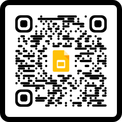
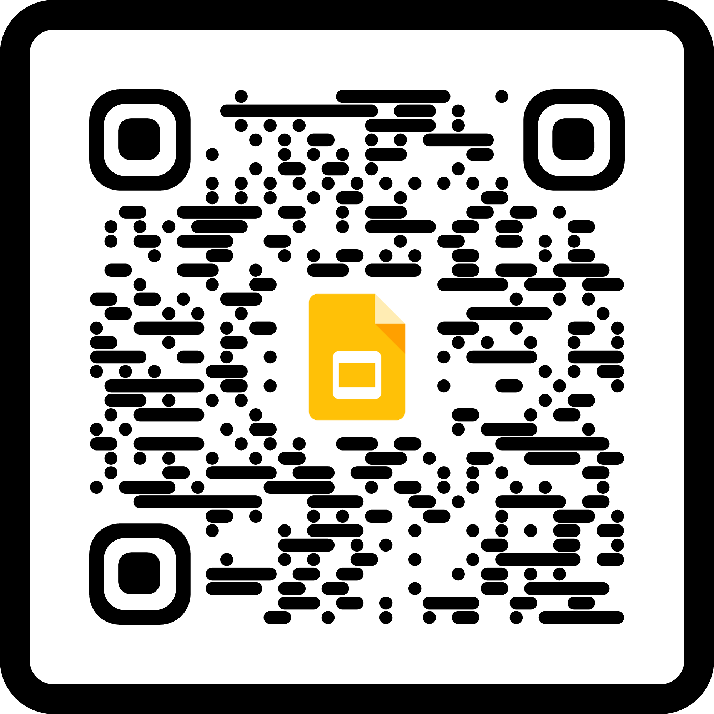

## Location

- Registration: https://rsvp.withgoogle.com/events/live-and-labs-geneva-2025 (closes soon).
- Workshop: https://goo.gle/adk-cli-workshop
- Credits: https://goo.gle/geneva-credits
- Slides on GH: https://goo.gle/adk-cli-geneve-slides

## workshop

- Link: https://goo.gle/adk-cli-workshop
- QR code for it:

## Credits:

duplication of 4!!!

- goo.gle/geneva-credits -> https://trygcp.dev/claim/h2-labs-geneva
- https://bit.ly/geneva-credits -> same
- Credits QR code
  

## Instructions Geneve ("Slides")

This is super-new experimental site:

https://palladius.github.io/gcp-launchpad-images/?onramp_url=https://trygcp.dev/claim/h2-labs-geneva&location=Geneva,CH&emoji=%F0%9F%87%A8%F0%9F%87%AD

=> goo.gle/adk-cli-geneve-slides

Done

FROM https://goo.gle/adk-cli-geneve-slides
TO https://palladius.github.io/gcp-launchpad-images/?onramp_url=https://trygcp.dev/claim/h2-labs-geneva&location=Geneva,CH&emoji=%F0%9F%87%A8%F0%9F%87%AD

TITLE ADK & Gemini CLI instructions on GitHub (experimental)

### If anyting fails:

- Use Milan Google Slides: https://docs.google.com/presentation/d/1f8yuyqoxA_eSaHSo08qL5ymJ-nhctctDnKL-WhVN2nI/edit?slide=id.g337964b5ba0_1_193#slide=id.g337964b5ba0_1_193
- Adapt with todya's stuff.
