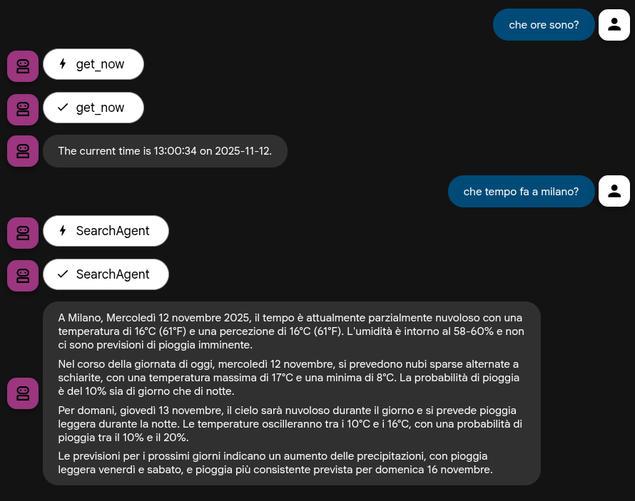

# Known Issues & Design Choices

This document lists known issues, limitations, and design decisions made during the development of this workshop.

## `gemini-2.5-flash` Limitation with Mixed Tool Types (Resolved via `AgentTool`)

**Issue:** The `gemini-2.5-flash` model, when used directly within a single `LlmAgent`, does not support making calls that mix different types of tools within the same turn. Specifically, it cannot handle a request that requires both a Grounding-based tool (like the built-in `google_search`) and a Function Calling-based tool (like our custom `get_now` function). This is a known limitation tracked in the official ADK repository under [issue #969](https://github.com/google/adk-python/issues/969).

**Impact:** This limitation initially affected the natural progression of the workshop. The original plan for Step 3 was to *add* `google_search` to the existing `get_now` tool. Doing so resulted in a `400 Bad Request` error from the model API.

**Workaround (Implemented in `step03b_search_and_tool`):**

As per ADK documentation (and confirmed with `google-adk` version 1.18.0+), built-in tools like `google_search` can be used with other tools by wrapping them in an `AgentTool`.

1.  **Create a dedicated agent for the built-in tool:** An `LlmAgent` is created whose *only* tool is `google_search`.
2.  **Wrap this dedicated agent in an `AgentTool`:** This `AgentTool` instance is then added to the main agent's `tools` list.

This effectively isolates the `google_search` tool within its own agent context, allowing the main agent to use it alongside other function-calling tools (like `get_now`) without triggering the model's mixed-tool limitation.

**Workshop Progression:**

*   The main workshop track (`step03_search`) has been modified to *replace* the `get_now` tool with `google_search`. This ensures the primary workshop path is functional and demonstrates how to add a search tool simply.
*   A separate, optional step (`step03b_search_and_tool`) has been created. This step demonstrates the `AgentTool` workaround, allowing both `get_now` and `google_search` to work together using `gemini-2.5-flash`.

## Resolution and Debugging Journey

After several iterations, the `step03b_search_and_tool` agent is now fully functional, demonstrating the successful coexistence of `google_search` and `get_now` tools. Here's a summary of the issues encountered and their resolutions:

1.  **Initial `ServerError: Overriding Recitation override rule is not supported for Vertex stack models.`**
    *   **Cause:** Incorrect initial attempt to manually create and wrap a search agent. The `create_google_search_agent` factory function was not being used, leading to improper configuration for the Vertex backend.
    *   **Fix:** Replaced the manual agent creation with the official `create_google_search_agent` factory function.

2.  **`TypeError: create_google_search_agent() missing 1 required positional argument: 'model'`**
    *   **Cause:** The `create_google_search_agent` factory function requires a `model` argument.
    *   **Fix:** Added `model="gemini-2.5-flash"` to the `create_google_search_agent` call.

3.  **`TypeError: FunctionTool.__init__() got an unexpected keyword argument 'callable'`**
    *   **Cause:** Incorrect keyword argument used for `FunctionTool` instantiation.
    *   **Fix:** Changed `callable` to `func` in the `FunctionTool` constructor.

4.  **`ValidationError: LlmAgent name Field required`**
    *   **Cause:** The inner `LlmAgent` created for `google_search` was missing a required `name` field.
    *   **Fix:** Added `name="SearchAgent"` to the `LlmAgent` definition for the search tool.

5.  **Persistent "Aborted!" message with `adk run` and piped input**
    *   **Cause:** This appears to be an issue with the `adk run` CLI runner's exit behavior when receiving piped input, rather than a bug in the agent's logic itself. The agent was producing correct output before aborting.
    *   **Workaround:** Modified the `just test-03b-manhouse` command in the `Justfile` to include `|| true`, which ignores the non-zero exit code from `adk run` and allows the `just` recipe to succeed.

**Verification:**

*   The `step03b_search_and_tool` agent now successfully responds to both time-related queries (using `get_now`) and general knowledge queries (using `google_search`) when run via the CLI (`just test-03b-manhouse`).
*   The functionality has also been successfully reproduced and verified on ADK Web, confirming the robust integration of both tool types.

# Screenshot

